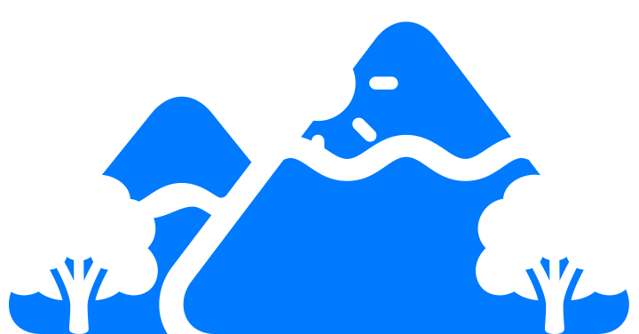

#  SwiftUI-BlendModeExamples [DRAFT]
This GitHub repository contains a comprehensive cheat sheet for blend modes, a crucial aspect of computer graphics. The cheat sheet provides a quick reference guide for each blend mode, detailing their function and characteristics and practical examples of their use.

## Motivation
The documentation on blend modes is incomplete and fragmented across different sources. For instance, Apple’s documentation on [Bitmap Images and Image Masks](https://developer.apple.com/library/archive/documentation/GraphicsImaging/Conceptual/drawingwithquartz2d/dq_images/dq_images.html) includes a section on using blend modes with images, but this information pertains to Quartz 2D rather than SwiftUI. Therefore, a comprehensive and up-to-date resource on blend modes specifically for SwiftUI is currently unavailable. And I want to fix it in this paper.

## Test code
```swift
var body: some View {
    sfImage("mountain.2.fill", .accentColor)
        .overlay(overlay.blendMode(blendMode))
        .compositingGroup()
}

var overlay: some View {
    VStack {
        sfImage("sun.max.fill", .orange)
        HStack {
            sfImage("tree.fill", .black)
            Spacer()
            sfImage("tree.fill", .white)
        }
    }
}

func sfImage(_ systemName: String, _ color: Color) -> some View {
    Image(systemName: systemName)
        .resizable()
        .scaledToFit()
        .foregroundColor(color)
}
```

## Example Usage
### Default mode
| Blend mode | Description | Result |
| --- | --- | --- |
| `.normal` | Draws the source image over the destination image with no blending or compositing effects applied. |  |

### Alpha clipping
| Blend mode | Description | Result |
| --- | --- | --- |
| `.destinationOut` | Makes the overlapping areas of the source and destination images transparent. |  |
| `.sourceAtop` | Draws the source image on top of the destination image, but only in the areas where they overlap. |  |

### Composing
| Blend mode | Description | Result |
| --- | --- | --- |
| `.destinationOver` | Draws the destination image on top of the source image. |  |

### Components multiplying
| Blend mode | Description | Result |
| --- | --- | --- |
| `.multiply` | Multiplies the colors of the source and destination images, resulting in a darker image. |  |
| `.screen` | Inversely multiplies the colors of the source and destination images, resulting in a lighter image. |  |
| `.overlay` | Combines Multiply and Screen blend modes, resulting in a combination of darker and lighter areas. |  |
| `.hardLight` | Combines Multiply and Screen blend modes, but with more intense effects. |  |
| `.softLight` | Darkens or lightens the destination image based on the colors of the source image. |  |

### Components selection by condition 
| Blend mode | Description | Result |
| --- | --- | --- |
| `.darken` | Selects the darker of the source and destination pixels for each pixel in the output image. |  |
| `.lighten` | Selects the lighter of the source and destination pixels for each pixel in the output image. |  |

### Components adding and subtracting
| Blend mode | Description | Result |
| --- | --- | --- |
| `.plusDarker` | Adds the source and destination pixel values and subtracts 0.5, resulting in a darker image. |  |
| `.plusLighter` | Adds the source and destination pixel values, resulting in a brighter image. |  |
| `.difference` | Subtracts the colors of the source image from the destination image, resulting in a negative image. |  |
| `.exclusion` | Similar to Difference blend mode, but with less intense effects. |  |

### Other
| Blend mode | Description | Result |
| --- | --- | --- |
| `.colorDodge` | Brightens the destination image based on the brightness of the source image. |  |
| `.colorBurn` | Darkens the destination image based on the darkness of the source image. |  |
| `.hue` | Changes the hue of the destination image based on the hue of the source image. |  |
| `.saturation` | Changes the saturation of the destination image based on the saturation of the source image. |  |
| `.color` | Changes the hue and saturation of the destination image based on the hue and saturation of the source image. |  |
| `.luminosity` | Changes the brightness of the destination image based on the brightness of the source image. |  |

